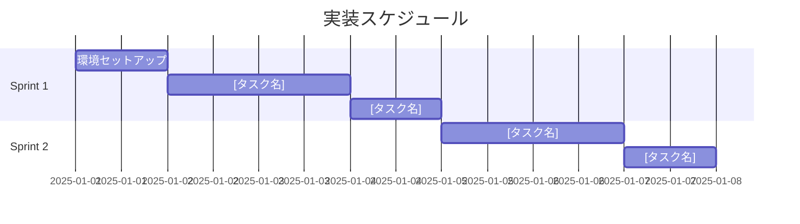

# [プロジェクト名] 実装スケジュール

## 全体サマリー

| 項目 | 内容 |
|------|------|
| 総スプリント数 | [N] スプリント |
| 予定期間 | [開始日] 〜 [終了日] |
| 総見積もり時間 | [X] 時間 |

---

## Sprint 1: [スプリント名]（[日数]日間）

### 目標
[このスプリントで達成すること]

### 成果物
- [ ] [成果物1]
- [ ] [成果物2]

### タスク分解

| # | タスク | 見積もり | 依存 | 種別 | 担当 |
|---|--------|----------|------|------|------|
| 1.1 | [タスク名] | [X]h | - | setup | Claude |
| 1.2 | [タスク名] | [X]h | 1.1 | feature | Claude |
| 1.3 | [タスク名] | [X]h | 1.2 | test | Claude |
| 1.4 | [タスク名] | [X]h | 1.3 | review | Human |

### 完了条件
- [ ] [条件1]
- [ ] [条件2]
- [ ] 全てのテストがパス

### リスク
- リスクレベル: 低/中/高
- 詳細: [リスクの説明]

---

## Sprint 2: [スプリント名]（[日数]日間）

### 目標
...

---

## 依存関係図

---

## リスク管理

| スプリント | リスク | 影響 | 対策 |
|------------|--------|------|------|
| Sprint [N] | [リスク] | 高/中/低 | [対策] |

---

## 進捗トラッキング

| Sprint | ステータス | 完了日 | メモ |
|--------|-----------|--------|------|
| Sprint 1 | 未着手/進行中/完了 | - | - |
| Sprint 2 | 未着手/進行中/完了 | - | - |
